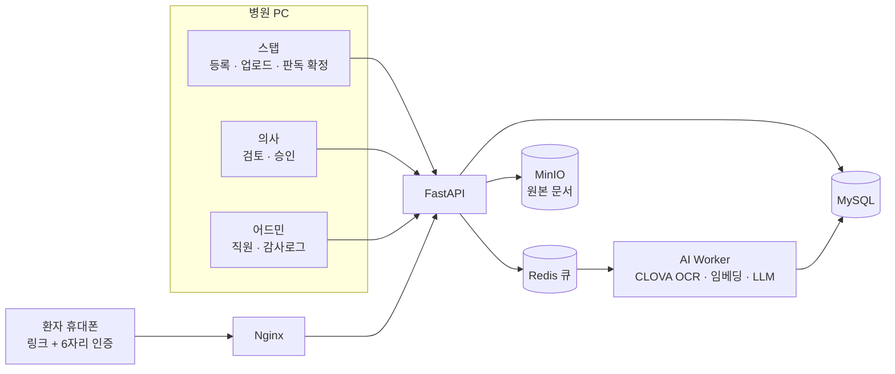
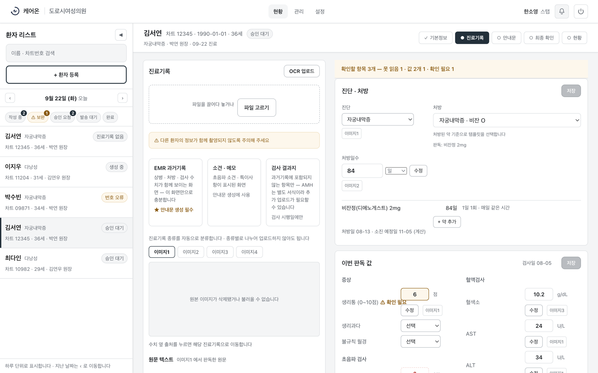
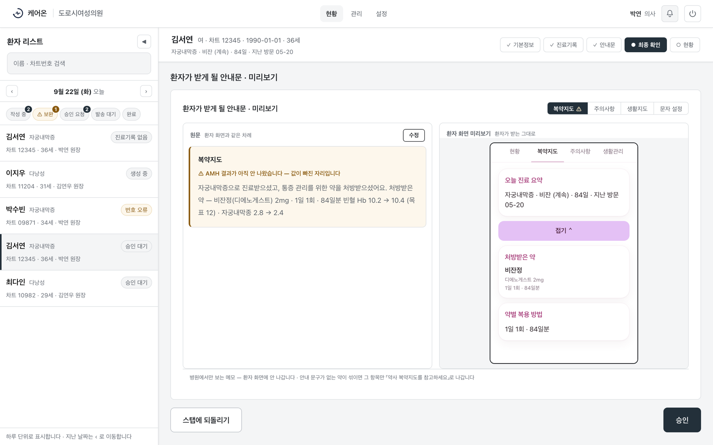
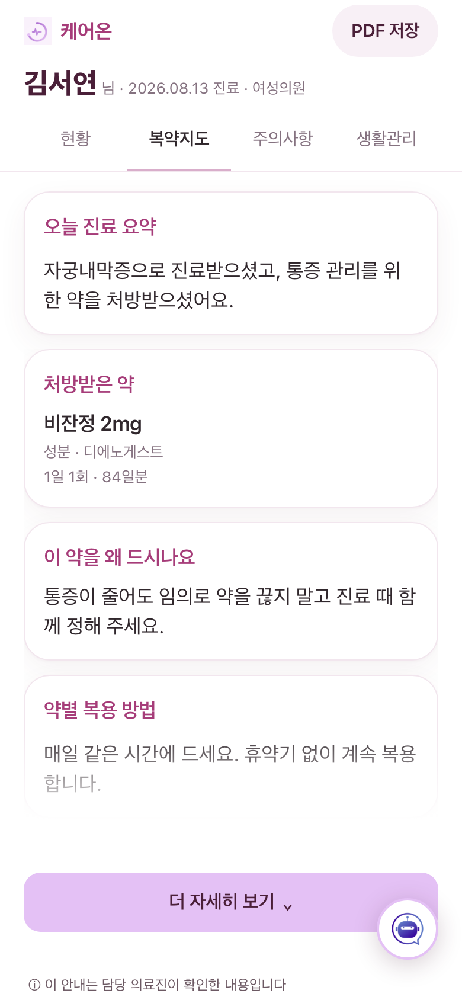
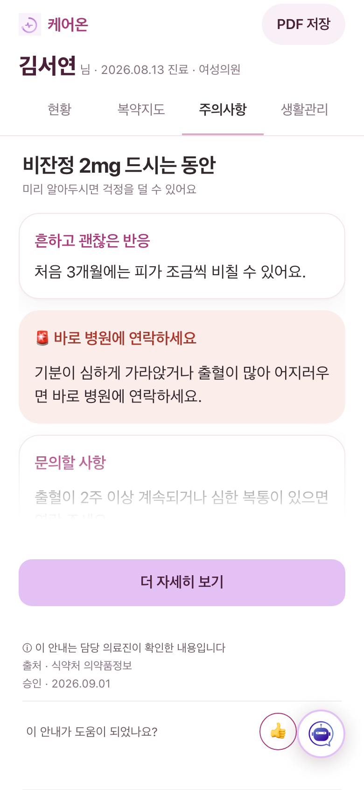
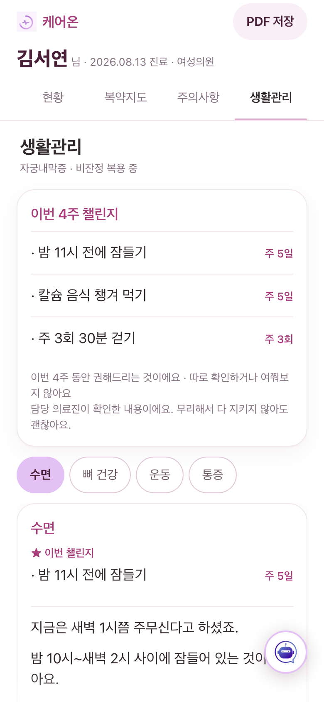
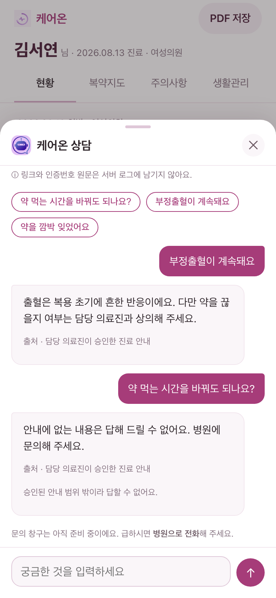
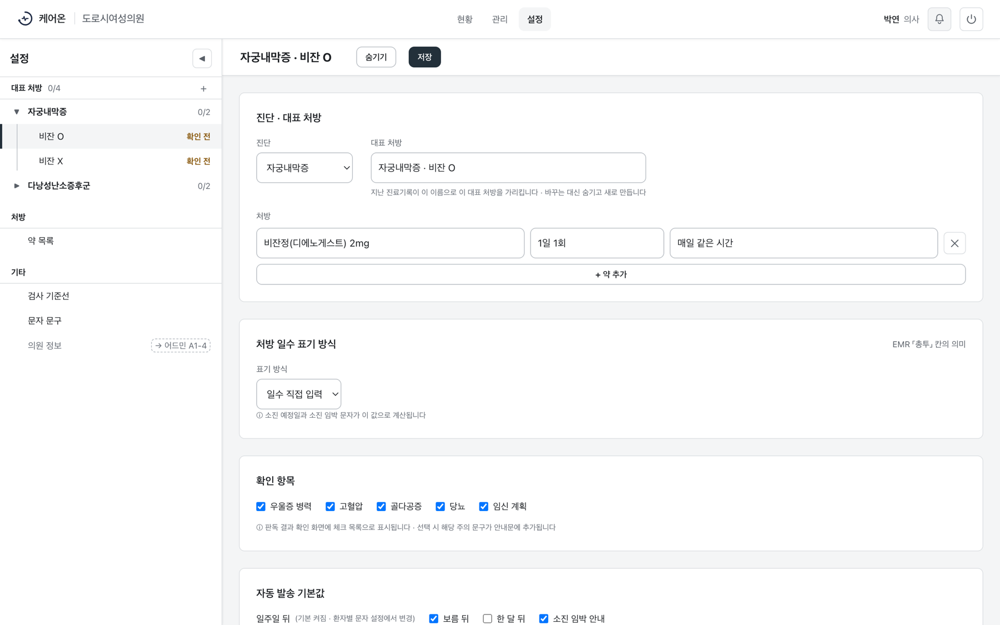
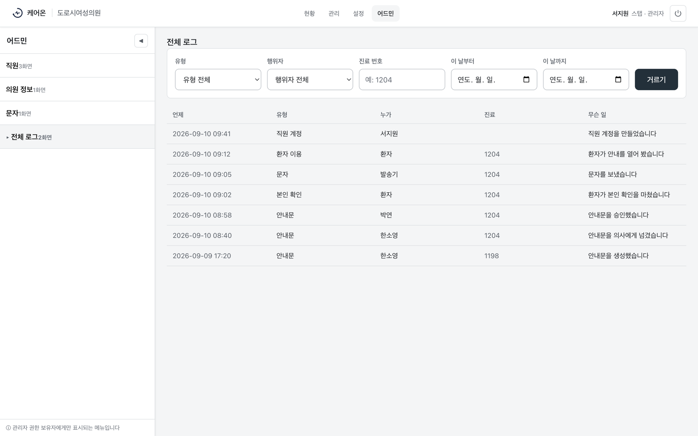
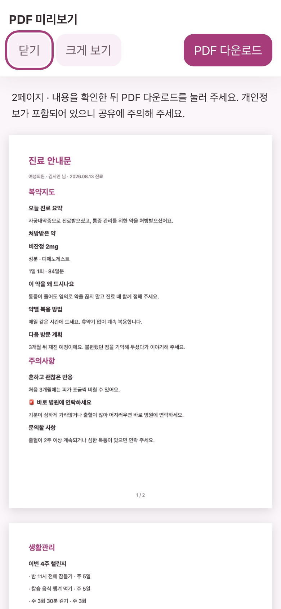

# 케어온 (Care-On)

> **진료 후 복약 안내를 안전하게 잇는 병원용 웹서비스**
> 확정된 진료 기록을 환자가 이해할 수 있는 안내문으로 옮기고, 의사가 승인한 내용만 문자 링크 하나로 전달합니다.

| | |
|---|---|
| 기간 | 2026.08.13 ~ 2026.09.22 (6주) · K-Digital Training AI 헬스케어 5기 |
| 팀 | 6팀 「핫식스」 5명 |
| 내 역할 | **기획 · 화면 설계**, 병원 공통 · 환자/진료 영역 주 담당, **Pilot 배포 · 운영** |
| 팀 저장소 | [AI-HealthCare-05/AH_05_06](https://github.com/AI-HealthCare-05/AH_05_06) |

### 기여 한눈에

| 병합 PR | 커밋 | 다른 팀원 PR 리뷰 | Pilot 운영 배포 |
|---|---|---|---|
| **166개** / 전체 334개 | **587개** / 전체 1,381개 | **71건** | **8회** |

커밋은 `develop` 기준, 머지 커밋 제외. 팀 전체로는 테스트 파일 308개(서버 191 · 화면 117)와 설계 결정 기록 8건을 남겼습니다.

---

## 1. 왜 만들었나

진료가 끝나는 순간, 복약 안내도 같이 끊깁니다.

- 다낭성난소증후군은 가임기 여성의 **10~13%** 가 겪지만 최대 70%는 진단조차 받지 못합니다
- 자궁내막증은 진단까지 평균 **4~12년**이 걸립니다
- 만성질환에서 처방대로 꾸준히 복용하는 환자는 **절반**뿐입니다

출처: WHO Fact sheet 「Polycystic ovary syndrome」(2026) · 「Endometriosis」(2025) · 「Adherence to long-term therapies」(2003)

병원은 진료 시간에 복약 설명까지 할 여유가 없고, 환자는 진료실에서 들은 것을 기억하지 못한 채 검증되지 않은 인터넷 정보를 믿게 됩니다. 그래서 **새 의학 정보를 만드는 것이 아니라, 이미 확정된 진료 결과를 환자가 이해할 수 있게 옮기는 일**에 집중했습니다.

## 2. 무엇을 만들었나

**문서 업로드 → OCR 판독 → 스탭 확정 → 안내문 생성 · 안전 검증 → 의사 승인 → 발송 직전 원본 삭제 → 환자 인증 · 열람 · 챗봇**

### 화면

로컬 목 모드에서 합성 데이터로 촬영했습니다. 화면의 환자 · 직원 · 의원 이름은 모두 가상입니다.

**스탭 — 판독 결과 확인.** 기계가 읽은 값은 스탭이 확정하기 전까지 쓰지 않습니다. 못 읽은 칸은 추측해서 채우지 않고 `?`로 비워 두고, 확신이 낮은 값은 「확인 필요」로, 문서마다 값이 다르면 「값 2개」로 세워 둡니다.

**의사 — 검토 · 승인.** 환자가 받을 화면을 그대로 옆에 띄워 놓고 승인합니다. 결과가 아직 안 나온 검사는 「값이 빠진 자리」라고 먼저 알려 줍니다.

**환자 — 문자 링크 하나로 여는 안내.** 앱 설치 없이 링크와 6자리 인증번호로 들어옵니다. 챗봇은 승인된 안내 안에서만 답하고, 약 변경처럼 안내에 없는 질문은 병원 문의로 돌립니다.

<table>
  <tr>
    <td></td>
    <td></td>
    <td></td>
    <td></td>
  </tr>
  <tr>
    <td align="center">복약지도</td>
    <td align="center">주의사항</td>
    <td align="center">생활관리</td>
    <td align="center">챗봇 — 근거 답변과 거절</td>
  </tr>
</table>

### 핵심 설계 원칙 — 틀린 안내는 없는 안내보다 위험하다

| 의료 안전 최우선 | 안전하게 실패한다 |
|---|---|
| 의학 문장을 지어내지 않는다 — 승인된 지식과 전문의 검토 문구만 | 불확실하면 멈춘다 — 「확인 필요」 · 「보류」로 세워 둔다 |
| 못 읽은 값은 비워 둔다 — 0이나 `-`로 채우지 않는다 | 실패를 성공처럼 보이지 않는다 |
| 의사 승인 없이는 아무것도 나가지 않는다 | 동작하지 않는 버튼을 두지 않는다 |
| 진단 · 약 변경 권고를 막는다 — 안내문과 챗봇 양쪽에서 | 실패해도 환자에게는 「복용을 바꾸지 말고 병원에 문의」 |

### 하지 않기로 한 것

| | 이유 |
|---|---|
| AI 진단 · 처방 권고 | 진단을 단정하거나 약을 바꾸라고 말하지 않는다. 판단은 의사에게 남긴다 |
| 실제 EMR 직접 연동 | 병원 전산과 붙이는 일은 범위 밖. 업로드한 문서로만 동작한다 |
| 병원의 챗봇 원문 열람 | 환자가 무엇을 물었는지 병원이 그대로 보지 않는다. 집계만 가능하다 |

진행하면서 **문자 발송 · OTP는 「가능하면」에서 실제 구현으로 올렸고**, 환자 본인 확인은 생년월일 대신 6자리 인증번호로 강화했습니다.

### 기획 문서 — 요구사항에서 데이터까지 한 흐름

**요구사항 정의서** → **사용자 시나리오** → **와이어프레임** 64화면 → **API 명세** 77경로 · 95메서드 → **ERD** 테이블 50개 → **데이터 흐름 정의서**

원칙은 하나입니다. **모든 데이터는 진료 건(`visit_id`)을 거쳐 연결하고 값을 복사하지 않는다.** 복사본이 생기면 어느 쪽이 맞는지 알 수 없고, 의료 기록에서는 그게 곧 사고이기 때문입니다.

### 팀 결과

| | |
|---|---|
| 배포 서버 응답 | 주요 API 9종 × 130회 = **1,170회 전부 200**, 동시 10건 P95 **0.69초 이하** · 최대 0.87초(목표 P95 3초) — 2026-09-21, 외부망 측정 |
| 승인 지식 검색(RAG) | 합성 평가셋(6개 질의) Recall@3 · Precision@3 **100%**, 금지 근거의 컨텍스트 진입 **0건**. 전용 벡터 DB 없이 MySQL에서 선필터 후 검색 |
| 멘토 피드백 반영 | 기능을 늘리는 대신 Sprint 4를 「시연 골격 굳히기」로 바꿔 **시연 차단 8건** 해소, 무인증 조회 경로 제거, 한 명령 구동 |
| 팀 자체 평가 | 완성도 **7.2 / 10** — 의료 안전은 게이트 · 테스트 · 결정 기록으로 강제했고, 예외 흐름과 화면 차별화는 다음 단계로 남김 |

---

## 3. 내가 한 일

### 3-1. 기획 · 화면 설계

**요구사항에서 화면, API, 데이터까지 한 줄로 이어지게** 설계했습니다.

- **설계 문서 3종**(모델 배치 · AI 워커 연동 · 인프라 규모)과 **합성 환자 · 진료 · 처방 · 검사결과 데이터 명세** 작성 — 실제 환자 데이터 없이 전 과정을 재현할 수 있는 기반 ([#3](https://github.com/AI-HealthCare-05/AH_05_06/pull/3) · [#6](https://github.com/AI-HealthCare-05/AH_05_06/pull/6))
- **와이어프레임 64프레임**(의료진 33 · 환자 24 · 어드민 7)을 저장소에 옮기고, 구현하며 드러난 공백을 반영해 **3.0.0**으로 갱신 ([#7](https://github.com/AI-HealthCare-05/AH_05_06/pull/7) · [#183](https://github.com/AI-HealthCare-05/AH_05_06/pull/183))
- 병원 화면 대부분을 직접 구현 — 로그인, 환자 등록 · 검색, 환자 카드, 진료기록 업로드, **판독 결과 확인**, **의사 검토 · 승인**, 현황, 설정, 어드민
- **환자 안내 화면**(복약지도 · 주의사항 · 생활관리)과 D+7 복약 · 통증 응답 화면 ([#38](https://github.com/AI-HealthCare-05/AH_05_06/pull/38) · [#55](https://github.com/AI-HealthCare-05/AH_05_06/pull/55))
- 긴 안내 본문을 **「■ 소제목」 카드로 나누고 「오늘 진료 요약」 한 줄을 조립** — 같은 내용이 세 번 반복되던 화면을 읽을 수 있는 단위로 재구성 ([#355](https://github.com/AI-HealthCare-05/AH_05_06/pull/355))
- **역할마다 핵심 업무를 4번의 조작 안에** 두도록 흐름을 설계 — 환자는 링크 → 인증번호 받기 → 6자리 입력 → 안내문, 스탭은 환자 선택 → 업로드 → 판독 확정 → 승인 요청, 의사는 대기 목록 → 미리보기 · 수정 → 승인 → 확인. 공통 디자인 토큰 · 공용 화면 틀 · 「준비 중」 표시를 통일
- 접근성(초점 · 건너뛰기 · 명도 대비), 로딩 · 빈 상태 · 오류 상태 일관성, 공통 컴포넌트 정리 ([#54](https://github.com/AI-HealthCare-05/AH_05_06/pull/54) · [#51](https://github.com/AI-HealthCare-05/AH_05_06/pull/51) · [#49](https://github.com/AI-HealthCare-05/AH_05_06/pull/49))

### 3-2. 병원 공통 · 환자/진료

- 직원 인증 백엔드(로그인 · 계정 잠금)와 **역할별 권한 매트릭스 테스트** ([#37](https://github.com/AI-HealthCare-05/AH_05_06/pull/37) · [#9](https://github.com/AI-HealthCare-05/AH_05_06/pull/9))
- **환자 본인 확인(OTP) 연결** — 실서버에서 링크를 열면 서버를 부르기도 전에 오류로 떨어지던 것(토큰을 목업에서만 읽던 문제) 복구, 세션이 끝나 인증으로 돌려보낼 때 돌아올 길 유지 ([#255](https://github.com/AI-HealthCare-05/AH_05_06/pull/255) · [#244](https://github.com/AI-HealthCare-05/AH_05_06/pull/244))
- **8/27 Walking Skeleton 구조 점검** — 합성 환자 · 진료 한 건을 고정해 로그인부터 환자 응답까지 네 사람의 구간이 같은 식별자로 이어지는지 확인하고, 막힌 자리를 실측해 기록 ([#77](https://github.com/AI-HealthCare-05/AH_05_06/pull/77) · [#90](https://github.com/AI-HealthCare-05/AH_05_06/pull/90))
- 처방을 **표 두 개로 구조화** — 복약안내가 「무엇을 언제까지」 말할 근거 ([#70](https://github.com/AI-HealthCare-05/AH_05_06/pull/70))
- **대표 처방 × 안내 갈래** 설정과 **승인 문구 정본** — 설정 화면과 안내문 생성이 같은 글을 보게 ([#192](https://github.com/AI-HealthCare-05/AH_05_06/pull/192) · [#214](https://github.com/AI-HealthCare-05/AH_05_06/pull/214))
- 어드민 — 직원 관리 · 의원 정보 · **감사 기록 조회** ([#285](https://github.com/AI-HealthCare-05/AH_05_06/pull/285) · [#287](https://github.com/AI-HealthCare-05/AH_05_06/pull/287) · [#295](https://github.com/AI-HealthCare-05/AH_05_06/pull/295))

<table>
  <tr>
    <td></td>
    <td></td>
  </tr>
  <tr>
    <td>설정 · 대표 처방 — 진단 × 처방 세트마다 기본 약, 확인 항목, 자동 발송을 정한다</td>
    <td>어드민 · 전체 로그 — 안내문 승인부터 문자 · 본인 확인 · 열람까지 진료 번호 하나로 따라간다. 토큰 · 전화번호 원문은 남기지 않는다</td>
  </tr>
</table>

### 3-3. 배포 · 운영 (Pilot)

- **배포 · 비밀값 경계 · 롤백 런북**을 쓰고, 실제 배포할 때마다 겪은 것을 런북에 되돌려 넣음 ([#133](https://github.com/AI-HealthCare-05/AH_05_06/pull/133) · [#365](https://github.com/AI-HealthCare-05/AH_05_06/pull/365) · [#370](https://github.com/AI-HealthCare-05/AH_05_06/pull/370))
- 이미지가 **자기가 어느 커밋인지 말하게** 라벨을 붙임 — 배포 사고 때 출처를 바로 밝힐 수 있게 ([#281](https://github.com/AI-HealthCare-05/AH_05_06/pull/281))
- 도메인 · HTTPS, API 명세 외부 차단, 실제 문자 OTP를 **승인된 번호에만 여는 좁은 문** ([#308](https://github.com/AI-HealthCare-05/AH_05_06/pull/308) · [#304](https://github.com/AI-HealthCare-05/AH_05_06/pull/304) · [#309](https://github.com/AI-HealthCare-05/AH_05_06/pull/309))
- 시연 전 5일간 **운영 배포 8회** — 배포 · 장애 · 결정을 매번 한 이슈에 기록해 팀이 서버 상태를 같은 그림으로 보게 함

---

## 4. 트러블슈팅

### ① RAG를 켜자 안내문 생성이 워커 안에서 죽었다

| | |
|---|---|
| **상황** | 승인된 지식으로 안내를 만드는 기능(RAG)을 켜자, 「안내문 생성」을 누르는 순간 워커가 반복해서 재시작되고 OCR 처리까지 끊김 |
| **원인** | RAG를 켜면 생성이 **API 서버에서 워커로 넘어가는** 구조였고, 워커가 임베딩 모델을 올리다 메모리 부족으로 강제 종료(`exit 137`). 서버는 2GB에 여유 약 300MB |
| **해결** | 인스턴스를 **2GB → 4GB**로 증설하고, 모델(458MB)을 **워커 이미지에 미리 구워** 첫 생성이 내려받기를 기다리지 않게 함 — 오프라인으로도 9.5초에 적재 ([#364](https://github.com/AI-HealthCare-05/AH_05_06/pull/364)) |
| **배운 점** | 기능 플래그 하나가 **실행 위치**까지 바꿀 수 있다. 켜기 전에 「이제 어디서 도는가」를 먼저 물어야 한다 |

### ② 서버를 키웠더니 사이트가 사라졌다

| | |
|---|---|
| **상황** | 증설을 위해 인스턴스를 중지 · 시작했더니 도메인 접속이 끊김 |
| **원인** | 퍼블릭 IP가 **고정 IP가 아닌 자동 할당**이라 재시작 때 주소가 바뀜. 인증서 자동 갱신도 같이 막히는 상황 |
| **해결** | 탄력적 IP로 고정 → DNS 변경 전 `curl --resolve`로 **새 주소에 도메인 이름 그대로 붙여** 인증서까지 미리 검증 → DNS 반영 확인. 「중지 전에 고정 IP인지 본다」를 런북에 추가 ([#365](https://github.com/AI-HealthCare-05/AH_05_06/pull/365)) |
| **배운 점** | 운영은 코드보다 **환경이 더 자주 무너진다.** 되돌릴 수 없는 조작 앞에는 확인 한 줄을 둔다 |

### ③ 화면에 보이는 약과 저장되는 약이 달랐다

| | |
|---|---|
| **상황** | RAG를 켠 채 시연 진료를 만들자 「안내문을 만들지 못했습니다」. 로그에는 `unrecognized_prescription` |
| **1차 원인** | 판독이 읽은 약 이름 `비잔정(디에노게스트)2mg`이 카탈로그의 `비잔정(디에노게스트) 2mg`과 **공백 한 칸** 달라 거절됨. 그 뿌리는 처방 세트에 **기본 약이 0건**이라 스탭이 약을 손으로 적어야 했던 것 |
| **1차 해결** | 세트에 기본 약을 심고, 약 목록을 **한 자리로 모아** 카탈로그와 세트가 갈라지지 않게 함 ([#367](https://github.com/AI-HealthCare-05/AH_05_06/pull/367)) |
| **진짜 원인** | 그래도 실패. DB를 보니 화면은 세트를 바꾸면 **야즈정**을 보여주는데, 확정하면 **판독이 읽은 비잔정**이 그대로 저장됨 — 화면과 저장값의 불일치 |
| **결과** | 원인을 코드 위치까지 특정해 팀 결정으로 넘기고, 시연은 검증된 경로로 확보 |
| **배운 점** | 기획은 화면만 그리는 일이 아니라 **「무엇이 저장되는가」까지 정하는 일**이다 |

### ④ 운영에서 로고가 빈 칸이었다 — 고치다 보니 PDF도 죽어 있었다

| | |
|---|---|
| **상황** | 병원 화면 상단바의 로고 자리가 빈 칸 |
| **원인** | Nginx 이미지는 테스트 파일 유출을 막으려고 폴더별로만 복사하는데, 로고용 `assets/` 폴더를 새로 만들면서 **복사 한 줄이 빠짐** → 운영에서 404 |
| **해결** | 폴더 단위가 아니라 **화면이 가리키는 파일을 하나하나 이미지 목록과 대조하는 검사**를 추가. 이 검사가 같은 원인으로 **환자 안내 PDF 라이브러리도 404**인 것을 찾아냄 → 둘 다 복구 ([#369](https://github.com/AI-HealthCare-05/AH_05_06/pull/369)) |
| **배운 점** | 조용히 비어 있는 실패가 가장 늦게 드러난다. **검사가 실제로 무는지** 일부러 깨뜨려(변이) 확인하는 습관을 들였다 |

복구 뒤의 환자 안내 PDF 미리보기

### 그 밖에 막은 것

- 접속 로그에 **환자 링크 토큰 · OTP가 그대로 남던 것** 차단 ([#85](https://github.com/AI-HealthCare-05/AH_05_06/pull/85))
- 리프레시 토큰 수명을 분 단위로 읽지 않아 **55년**이 되던 것 → 14일 ([#13](https://github.com/AI-HealthCare-05/AH_05_06/pull/13))
- 배포가 프런트를 싣지 않고 **조용히 성공하던 세 자리** ([#202](https://github.com/AI-HealthCare-05/AH_05_06/pull/202))

---

## 5. 기술 스택

| 영역 | 사용 기술 |
|---|---|
| API | Python 3.13 · FastAPI · Tortoise ORM · Pydantic — DB · Redis · 외부 API까지 전부 async(asyncmy · httpx) |
| 비동기 작업 | AI Worker · Redis 큐 |
| 데이터 | MySQL 8.0 · MinIO(S3 호환, 원본 문서) |
| AI | CLOVA OCR · OpenAI gpt-4o-mini · 로컬 임베딩(다국어 MiniLM 384차원, 외부 전송 없음) |
| 화면 | HTML · CSS · ES5 JavaScript (빌드 없음) |
| 인프라 | AWS EC2 · Docker Compose · Nginx · Let's Encrypt · Solapi(문자) |
| 품질 | GitHub Actions · Ruff · Mypy · Pytest · 화면 계약 검사(`node --test`) |
| 협업 | Jira ↔ GitHub 상태 자동 전환 · PR 리뷰 · uv · AI 코딩 도구 |

---

## 6. 회고

**잘한 점** — 환자 화면을 「읽을 수 있는 단위」로 다시 설계했고, 배포 · 장애 · 결정을 전부 기록으로 남겨 팀이 같은 상태를 보게 했다.

**아쉬운 점** — 화면에 보이는 값과 저장되는 값의 불일치를 시연 직전에야 발견했다. 설계 단계에서 「화면이 보여주는 것 = 저장되는 것」을 계약으로 못 박았어야 했다. 그리고 병원 화면 구성이 기존 EMR 방식과 비슷해, 케어온만의 특징을 화면에 충분히 담지 못했다.

**배우고 성장한 점** — 문제 발견과 기획부터 제작, 배포와 운영까지 한 서비스를 처음부터 끝까지 경험했다. 의료 안내에서는 문장 한 줄과 공백 한 칸이 기능만큼 중요하다. 그리고 운영에서는 조용히 넘어가는 실패가 가장 위험하다 — 막히면 크게 멈추게 만들어야 사람이 알아챈다.

개인 자체 평가 7.5 / 10 · 팀 완성도 평가 7.2 / 10

> 팀 회고 한 줄 — AI 도구로 속도는 얻었지만, 품질을 지킨 것은 리뷰와 결정 기록이었다. 의료 서비스는 만들 줄 아는 것만으로는 부족했고, 무엇을 만들면 안 되는지 아는 일이 함께 필요했다.

### 다음 단계

- **D+7 복약 · 통증 확인** 완성 — 환자 응답과 병원 확인 화면을 이어 진료 후 이탈을 일찍 발견
- **실제 발송 범위 확대** — 승인된 번호에만 열어 둔 좁은 문을 운영 검증 뒤 단계적으로 해제
- **RAG 확장** — 자궁내막증 생활관리도 고정 문구에서 검색 근거로 넓히고 섹션별 질의 품질을 계속 측정
- **규모 대응** — 승인 청크 5만 개 · 검색 p95 200ms 같은 전환 기준을 지켜보다 넘으면 벡터 저장소 비교
- **어드민 확장** — 직원 정보 수정 · 비밀번호 재설정, 문자 잔량 확인

---

이 저장소는 포트폴리오 정리용입니다. 모든 데이터는 합성 데이터이며 실제 환자 정보를 포함하지 않습니다. 코드와 전체 이력은 [팀 저장소](https://github.com/AI-HealthCare-05/AH_05_06)에 있습니다.
